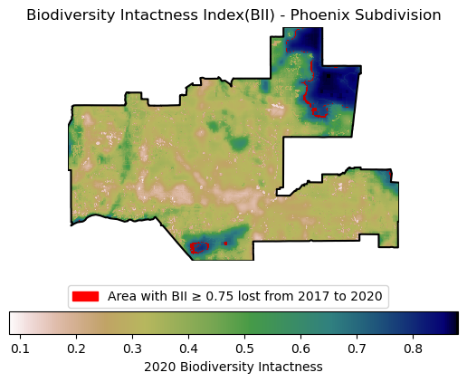

# Biodiversity Intactness Index(BII) Assessment
The Goal of this assessment will be to create the following map that shows the BII from 2020 with highlighted areas that show where high biodiversity areas were lost from 2017 to 2020.

## Context
In 2021, Maricopa County, which encompasses the Phoenix metropolitan area, was the US county that added the most developed land since 2001 [1]. Urban sprawl creates pressure on biodiversity and natural areas. In this task you will explore a dataset showing values for a biodiversity intactness index (BII) to find changes in this BII around the Phoenix area from 2017 to 2020. 

1. Levitt, Z., &amp; Eng&nbsp; , J. (2021, August 11). Where America’s developed areas are growing: ‘Way off into the horizon.’ https://www.washingtonpost.com/nation/interactive/2021/land-development-urban-growth-maps/ 

## Data access:
BII data: This dataset is part of the MPC STAC catalog. You will need to access the ‘io-biodiversity’ collection and look for the 2017 and 2020 rasters covering Phoenix subdivision. You can learn more about the dataset here: Microsoft Planetary Computer. Planetary Computer. (n.d.). https://planetarycomputer.microsoft.com/dataset/io-biodiversity#overview 

Phoenix subdivision: You will find the Phoenix subdivision polygon in the Census County Subdivision shapefiles for Arizona: Responsible Party U.S. Department of Commerce, U.S. Census Bureau, Geography Division, Spatial Data Collection and Products Branch (Publisher). (2022, November 1). Tiger/line shapefile, 2021, state, Arizona, county subdivisions. Catalog. https://catalog.data.gov/dataset/tiger-line-shapefile-2021-state-arizona-county-subdivisions 

[def]: attachment:BII_map.png